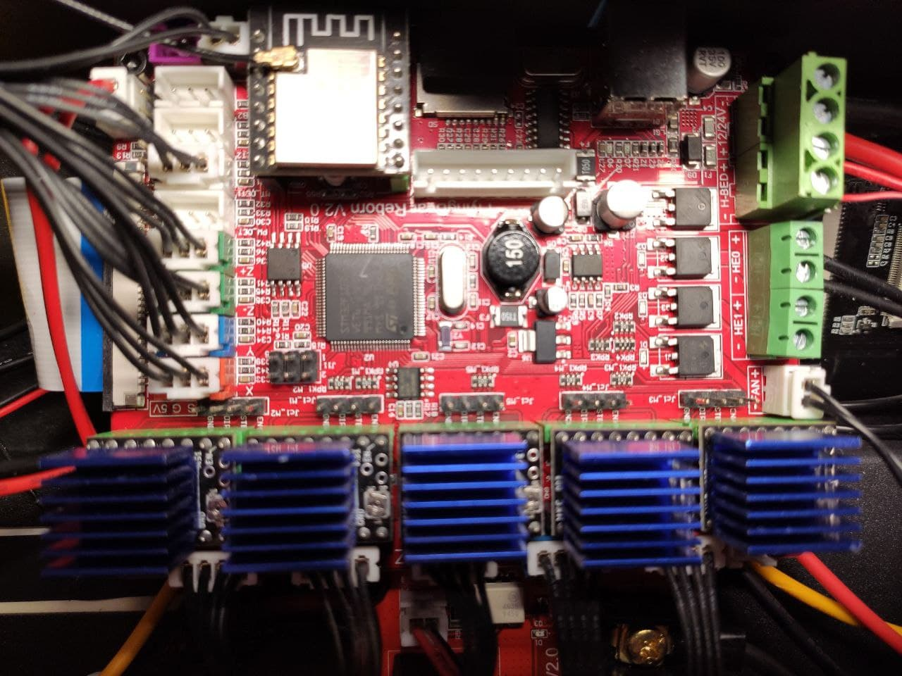
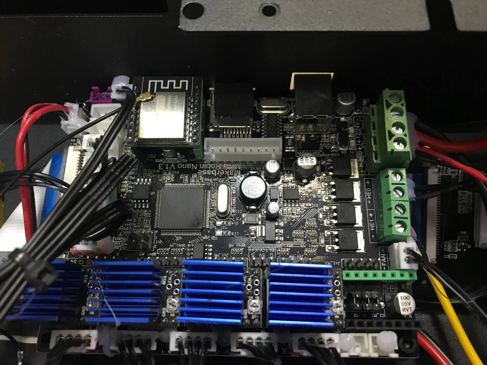
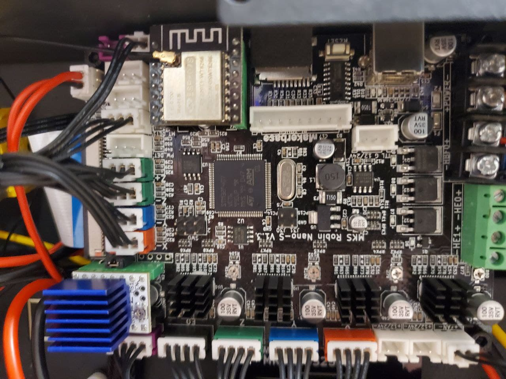

##### 1. Дисклеймер.
**Использование стоковой прошивки [ОПАСНО](https://t.me/Reborn_3D/52112) для вас и вашего помещения!** В стоковой прошивке отключены защиты от "ухода" температуры и в случае отказа термистора происходит неконтролируемый разогрев.

##### 1. Виды плат.
На текущий момент, для принтеров Reborn V0 и Reborn V1 известны следующие платы:
1. Robin Nano 1.1, известна так же как Flyingbear Reborn v2.0 или Robin Nano 1.2. Чаще всего встречалась в версии принтера Reborn V0, все драйвера 2225 съемные.

2. Robin Nano 1.3, похожа на Robin Nano 1.1, но имеет другой контроллер. Чаще всего встречалась в версии принтера Reborn V1, все драйвера 2225 съемные.

3. Robin Nano S 1.3, похожа на Robin Nano 1.3, но имеет только один съемный драйвер. Комплектуется драйверами 2225, вне зависимости, распаяны они или нет. В стоковом состоянии съемный драйвер контролирует ось Z2.

Ознакомиться со схемами плат можно в [репозитории MKS](https://github.com/makerbase-mks/MKS-Robin-Nano-V1.X/tree/master/hardware).
Стоковые прошивки можно получить [тут](fb_default_fw/) ([Источник](https://drive.google.com/drive/folders/1io_umO7EgzTLTE5pZwcePNe2q0zt-har)).
Перечень транзисторов для ремонта [tg](https://t.me/Reborn_3D/143279) 

##### 2. Кастомные прошивки.
В сообществе разработанны и поддерживаются следующие прошивки на основе Marlin 2.0:

| Автор | Совместимость | Ссылка |
| ------------ | ------------ | ------------ |
| Serg Panin | 1.1  | [github](https://github.com/SergPanin/Marlin_REBORN)  |
| AndyBig  | 1.1/1.3/S1.3  | [github](https://github.com/Andy-Big/Marlin_FB_Reborn)  |
| Yep it is me again  | S1.3  | [tg](https://t.me/Reborn_3D/25082)  |
| Nikolay  | 1.3  | [tg](https://t.me/Reborn_3D/26082)  |
| Aleksey K  | 1.3  | [github](https://github.com/oducceu/Marlin_REBORN)  |
| Timofey Titovets  | 1.1/1.3/S1.3  | [github](https://github.com/Nefelim4ag/Marlin/tree/Marlin_FB_Reborn)  |
| Артем Квантов  | S1.3  | [tg](https://t.me/Reborn_3D/37005)  |

##### 3. Конфигурации Klipper.
Стоковые платы могут управляться при помощи Klipper:
Пример конфигурации от Flox Urys [tg](https://t.me/Reborn_3D/137953)
*[Устарело]*  Пример конфигурации от Aleksey K [github](https://github.com/oducceu/klipper_configs/tree/master/Flying%20Bear%20Generic%20Configs)
Рекоммендуется изучить вики призраков [flyingbear.info](https://flyingbear.info/ru/firmware/klipper)

##### 4. Взаимодействие по WiFi
###### 4.1 Cura
В большинстве случаев хватает установки [MKS WiFi plugin](https://github.com/Jeredian/mks-wifi-plugin). У них даже есть [чат](https://t.me/Reborn_3D/24975).

###### 4.2 MKS-WIFI Uploader for PS
Автономный загрузчик для альтернативных слайсеров и прочих средств автоматизации. Есть [оригинальная](https://github.com/ArtificalSUN/MKS-WIFI_PS_uploader) версия и содержащая множество [исправлений](https://github.com/Andy-Big/MKS-WIFI_uploader) от AndyBig.
Можно ознакомиться с инструкциями от  [Наблюдатель](https://t.me/Reborn_3D/131882)  и [BR](https://t.me/Reborn_3D/15504)

###### 4.3 BeePrint
Для поддержания взаимодействия по WiFi используются платы на основе ESP32, для которых можно тоже установить кастомную прошивку [BeePrint](https://github.com/xreef/MKS_WIFI_upgrade_with_BeePrint_web_interface). Можно ознакомиться с инструкцией от [Timofey Titovets](https://t.me/Reborn_3D/53649)

##### 5. Взаимодействие по USB
Подключив принтер по USB, можно взаимодействовать через программу [Repetier-Host](https://3dtoday.ru/blogs/3dtool/help-a-lot-of-beginners-repetierhost-first-steps-part-1), однако для этого необходимо установить [драйвер](https://t.me/Reborn_3D/50240)

##### 6. Взаимодействие со слайсерами
###### 6.1 Cura
Для работы с Cura можно использовать либо Custom FFF либо профиль от 5 призрака, откорректировав размеры печатной области. 

Можно ознакомиться c:
- пример стартового кода от [Serg Panin](https://t.me/Reborn_3D/11026)
- примеры профилей печати [pla/petg](https://t.me/Reborn_3D/24719)/[flex](https://t.me/Reborn_3D/117086)/[Esun ABS+](https://t.me/Reborn_3D/136246)/[FDPlas TPU](https://t.me/Reborn_3D/138546)
- набором полезных советов от [Timofey Titovets](https://t.me/Reborn_3D/100187)
- рекоммендациями по настройке поддержек от [Roman](https://t.me/Reborn_3D/163785)

###### 6.2 PrusaSlicer
Можно ознакомиться c:
- [видеогайдом](https://youtu.be/BMbgFgzPcG8) по настройке
- примеры профилей [AndyBig](https://t.me/Reborn_3D/155316)/[Наблюдатель](https://t.me/Reborn_3D/155189)

##### 7. Подключение драйверов по UART
Для более гибкого управления драйверами, можно произвести подключение по UART. Однако, это сопряжено с трудностями и требует достаточно прямых рук. В некоторых случаях придется заимствовать линию UART, работающую с WiFi модулем.

Можно ознакомиться c:
- Использование MKS Nano 1.3 + TMC2209 от [Semyon K.](https://3dtoday.ru/blogs/semmyk/msk-nano-13-tmc2209-v-rezime-uart)
- Использование MKS Nano S1.3 + TMC2209 от [Ruslan P](https://t.me/Reborn_3D/121962)
- Использование MKS Nano 1.1/1.2 + TMC2209 от [призраков](https://github.com/Sergey1560/fb4s_howto/blob/master/tmc_uart/readme.md#%D0%BD%D0%B0%D1%81%D1%82%D1%80%D0%BE%D0%B9%D0%BA%D0%B0-%D0%B4%D1%80%D0%B0%D0%B9%D0%B2%D0%B5%D1%80%D0%BE%D0%B2-tmc-2209-%D0%BF%D0%BE%D0%B4%D0%BA%D0%BB%D1%8E%D1%87%D0%B5%D0%BD%D0%B8%D0%B5-%D0%BF%D0%BE-uart-%D0%BA-robin-nano)

##### 8. Другие полезные моменты
- Про подключение [BL touch](https://3dtoday.ru/blogs/semmyk/msk-nano-13-3d-touh-bl-touch-klipper)
- Про [Octupus](https://t.me/Reborn_3D/23968)
- Про [OctoPrint](https://t.me/Reborn_3D/19987)
- Про [Vref 2225](https://t.me/Reborn_3D/40426) и [дефолтные значения](https://t.me/Reborn_3D/71019)

