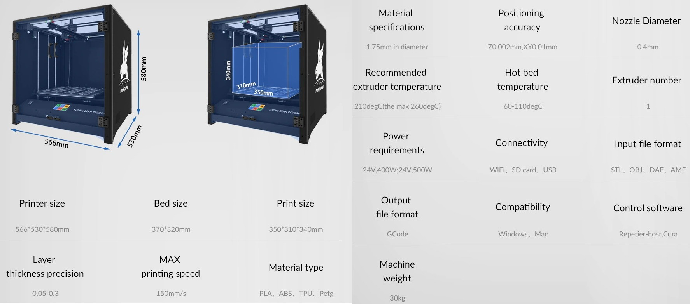

# Памятка молодого бойца v0.2

## Введение

Товарищ! Поздравляем вас с приобретением /китайского поделия дядюшки Ляо/ отличного принтера Flying Bear Reborn!
Независимо от того, являешься ты матерым печатником или зеленым перворазом, внимательно прочти памятку - это сэкономит
время тебе и твоим коллегам в чате.

> Примечание: будем руководствоваться исходными данными текущей, серийно выпускаемой, модели принтера, имеющей рельсу
> по Y и валы по X.

## Пока принтер в пути

Пока принтер едет на оленях по бескрайним просторам нашей необъятной Родины, нужно решить несколько важных моментов,
дабы сэкономить время в дальнейшем:

### Место

Внимательно пройдись по своей сычевальне и определи место, где будет стоять твой новый принтер Потому что он большой.
Нет, очень большой. Серьезно. Габаритные размеры 566х529х582мм (ШхГхВ). И это без учета запаса высоты под гофру с
кабелем к голове или термокупол. Для этого еще надо докинуть 200-250мм в высоту. Так же стоит учитывать наличие рядом
стоящих с принтером вспомогательных предметов, такие как сушилка, мусорка, коробочка с инструментом в быстром доступе и
т.д., это тоже требует увеличение места по ширине.

### Доработки

Есть минимальный набор небольших доработок, которые можно произвести для комфортной печати на этом принтере еще на
старте. Конечно, принтер _/скорее всего/_ будет печатать и без них, но по опыту эксплуатации коллегами по цеху, был
выявлен список того, как сделать хорошо и за недорого:

#### Обдув чебурашка.

Это Стоковый обдув дует куда угодно, но не в область печати, да и весит очень много. Нужно купить
два [вентилятора](https://aliexpress.ru/item/32799376487.html?spm=2114.13010708.0.0.569733ed33A347)
4010, 24в, шарикоподшипниковые и напечатать [один](https://www.thingiverse.com/thing:4773410) из
[двух](https://www.thingiverse.com/thing:4845272) вариантов держателя. Корпус обдува можно попросить напечатать товарища
или сделать это самому на стоке из PETG. Для начала PETG вполне хватит, только не забудь экранировать алюминиевым
скотчем те части печатной модели, что находятся рядом с соплом. В дальнейшем его можно перепечатать из ABS или нейлона.
> Необходимость: **10/10**.

#### Горло.

В стоке горло полое, с тефлоновой трубкой внутри (bore heatbreak).
_/Кривые руки китайца/_ Это доставляет ряд проблем - трубка зачастую отрезана не ровно или не по размеру. В дальнейшем _
/будет развлекать тебя пробками/_ могут возникнуть ряд проблем и не получится печатать высокотемпературными пластиками
по типу ABS. Само горло тоже _/хитрогнутое/_ нестандартное, имеет резьбу только со стороны хот-енда и гладкое к
колд-енду, ближайший аналог - химера. Рекомендуется сразу взять би-металлическое за недорого от
[Меллоу (NF DCrazy)](https://aliexpress.ru/item/4000853239324.html?item_id=4000853239324&sku_id=10000009400301780&spm=a2g2w.detail.1000023.38.61d66546vhLb7b)
.
> Необходимость: **8/10**.

#### Сопло

Это, пожалуй, единственная деталь, которая хоть как-то соответствует _/представлением китайцев о/_ стандарту e3d v6.
Комплектное зачастую идет рандомного качества, рекомендуется взять пару штук ходовых номиналов - 0.4 и 0.6 мм. Можно
взять
у [Треугольников](https://aliexpress.ru/item/32993360291.html?spm=a2g0o.store_pc_groupList.8148356.19.1f3e26f5NM5e3t)
или [Меллоу](https://aliexpress.ru/item/32957162791.html?spm=a2g0o.store_pc_groupList.8148356.8.7a7178abP8E9Tc), в
зависимости от предпочтений.
> Необходимость: **5-8/10** ибо лотерея.

#### Рельсы и каретки.

Качество в серии стало определенно получше, но так же часто является источником _/баттхерта/_ проблем. Для оси Y рельса
длиной 350мм, каретка 12С (короткая). Рекомендуется поменять в сборе на
_
богоподобный [HIWIN](https://aliexpress.ru/item/1005001786412931.html?spm=a2g0o.store_pc_groupList.8148356.10.50734085D0Qgn3)_
народный бренд типа [Venstpow](https://aliexpress.ru/item/32806622073.html?spm=2114.13010708.0.0.569733edMBG9aM)
или [KGT](https://aliexpress.ru/item/1000007480470.html?spm=a2g0o.store_pc_home.productList_1000000751396.subject_0). На
этом этапе стоит задуматься о [переходе с валов на рельсы](https://www.thingiverse.com/thing:4982457) и затарить все за
один заход.
> Необходимость: **5-8/10** ибо лотерея.

#### Обдув радиатора колд-енда.

Если была бы номинация на самый шумный вентилятор - он бы взял первое место. Стоит копейки, а на мозги давит на порядок
меньше. Автор брал
у [Треугольников](https://aliexpress.ru/item/32815705081.html?spm=a2g39.deletedorders.0.0.4ba44aa6d1lO6q), все так же
24в.
> Необходимость: **5/10**.

#### Термистор хот-енда.

Стоит без гильзы, качество индуцируемых температурных попугаев сильно разнится. Рекомендуется взять HT-NTC100K в гильзе
от [Меллоу](https://aliexpress.ru/item/32888205306.html), благо стоит копье.
> Необходимость: **5/10**.

#### Обводные подшипники ремня.

Стоят рандомного качества, могут заедать _/и нежно похрустывать/_. Рекомендуется сразу на этапе сборки заменить на
годные (вплоть ABEC-7). Нужно F624ZZ (или F624-2RS), 16шт, из любого понравившегося магазина.
> Необходимость: **5/10**.

#### Фланцевые линейные подшипники оси Z.

Стоят сомнительного качества, могут _/содержать камни и части мертвых животных/_ заедать. Рекомендуется сразу на этапе
сборки заменить на годные. Нужно 4шт, например
от [MSM](https://aliexpress.ru/item/32815741633.html?spm=2114.13010708.0.0.569733ed33A347) (LMK10LUU - 10мм, удлиненные)
.
> Необходимость: **5/10**.

### Расходка

Расходные материалы, наличие которых также надо проверить в закромах Родины или затарить в магазине.

#### Изопропиловый безводный спирт и уайт-спирит.

Потребуется как для промывки подшипников-кареток, так и для протирки направляющих-рельс-стола. Добывается в
хозяйственном или на ВсеИнструменты.

#### Смазка.

Принтер поставляется в основном сухим с жидкими остатками консервы. Потребуется для _/плавного погружения в мир 3d
печати/_ обработки подвижных узлов и агрегатов принтера. Рекомендуется брать на основе литиевого мыла, класса EP-2.
Добывается в автомагазине. Автор пользуется EFELE MG211 NLGI-2 чего и вам советует, хотя кто-то мажет _/оливковым/_
литолом. В чате много холиваров на эту тему.

#### Адгезивы.

На стоковую ультрабазу PLA липнет без посторонней помощи, PETG и далее может потребовать адгезив. Можно приобрести как
готовый (например ЯСделять), так и сварганить самому из смеси [Энтеродез](https://www.eapteka.ru/goods/id281886/) (PVP,
он же повидон) с изопропиловым спиртом.

#### Филамент.

Да-да, в комплекте не идет даже маленького огрызка, так что нужно проверить запасы своего любимого пластика. Если
любимого еще нет, можно выбрать из следующих:

- [eSun](https://esun.aliexpress.ru/store/5800267?spm=a2g2w.productlist.0.0.5c47709ecnKUOy)
- [Sunlu](https://zhuhaisunlu.aliexpress.ru/store/3223105?spm=a2g2w.productlist.0.0.3ec17e53fP7ZjE)
- [FDPlast](https://www.sopytka.ru/products/prutki-dlya-3d-printera/).

Рекомендуется начать с PLA, с переходом потом на PETG.

## Сборка и дефектовка

Поздравляю! Коробка с вожделенным станком лежит у тебя в комнате. Теперь есть пара моментов, которые нужно отметить в
процессе сборки:

- Перед закрытием заказа на Али, проверь комплектность приехавших тебе деталей. В коробке есть упаковочный лист, сверься
  с ним. Проверь сохранность содержимого, так как _/футболисты/_ работники почты могут доставить квадратное - круглым.
  Не торопись закрывать заказ до полной сборки и первого включения принтера - он может иметь скрытые дефекты или
  волшебный дым может выйти из него раньше, чем ты напечатаешь первый кубик. Пока заказ открыт - можно _/выкручивать
  яйца/_ договориться с продавцом о досылке или замене узлов.

- Посмотри видео о сборке
  на [официальном канале](https://www.youtube.com/watch?v=SjS6YbjA6Mo&list=PLBySo3_ol6kTPV7DQlauIK-ouXzNKx0BJ) медведей
  хотя бы раз. Несмотря на очевидность процесса, что-то да можно упустить.

- Отклей и смой двусторонний скотч со стекла стола. Ни в коем случае не приклеивай стол, сложит блюдцем при нагреве! О
  том как смыть скотч можно посмотреть в оглавлении или поиском по чату - намучались с этим прилично.

- Проверяй затяжку всех клемм. Не поленись, разбери разъем кабеля от головы и проверь правильность соединения по
  картинке с [гуглодоков](https://drive.google.com/drive/folders/1wep6x4SG3Y25EMr80MuOctOxUgeLOCWE) медведей. Найди в
  подвале мосфет стола, проверь пайку и наличие соплей.

- Промой линейные подшипники, каретки. Протри валы и рельсы. Набей каретки и линейные подшипники смазкой. Смажь валы и
  рельсы после установки.

- Проверь затяжку муфт двигателей, муфты не должны болтаться.

- Установи тип платы. Это потребуется в дальнейшем, при перепрошивке на [марлин](https://marlinfw.org/). Если драйвера
  съемные - определи драйвер экструдера и запаяй перемычку, чтоб по два раза не лезть в подвал. По типам плат, прошивкам
  и перемычке много информации в оглавлении чата.

- Проверь состояние и затяжку ремней. Ремни должны быть без бахромы, затяжка для обоих двигателей - равномерная.

- Проверь затяжку хот-енда на горячую, на заводе могут не докрутить.

## Пуско-наладка

Если после включения волшебный дым не вышел, а экранчик показал меню - пол дела сделано!

- Перед первой парковкой проверь работоспособность концевиков. Возьми непрозрачный, токонероводящий плоский предмет (
  например, кусочек непрозрачного пластика) и потыкай им вместо флажка в концевик. Концевик должен индуцировать
  срабатывание включением светодиода, а принтер - пикнуть (если звук срабатывания концевиков включен в настройках
  прошивки).

- Проверь показания термодатчиков хот-енда и стола. Они должны стабильно показывать комнатную температуру.

- Припаркуй оси. Голова и стол должны перемещаться плавно, без скрежещущих звуков.

- Подготовь свой любимый слайсер для работы. В случае, если это кура _/куру в суп!/_, для нее в оглавлении чата есть
  референсные настройки принтера, профилей и ссылка на wi-fi плагин.

- Заправь филамент, предварительно разогрев голову до характерной для этого пластика температуры. При заправке шестерни
  фидера должны крутиться плавно и без хруста, продавленный филамент выходить из сопла ровной ниткой. Из хот-енда не
  должен идти дым и сочиться пластик из сочленений.

- Сними транспортировочную пленку со стекла, протри его спиртом, заранее прогрей до рабочей температуры.

- ...

- PROFIT! Ваш первый кубик готов.

## Модернизация

Товарищ, помни! 3D принтер — это не только помощник в хозяйстве, но и отличный конструктор, развивающий мелкую моторику,
пространственное воображение и системное мышление. При этом, правильно примененная доработка может значительно поднять
качество, скорость печати или эргономичность самого принтера.

Реборн имеет очень большой потенциал для модернизаций:

- Прошивки марлин и клиппер;
- Перевод с валов на рельсы;
- 10мм ремни и натяжители;
- Полноценный e3d v6, вулкан или целые кастомные головы на их основе;
- "Краб" со сменными головами;
- Кастомные столы, в т.ч. магнитные или с подогревом 220v;
- Полная термокамера;
- LED подсветка;
- и даже установка ШВП на ось Z.

Большому кораблю - большое плавание. Большинство аспектов освещены в оглавлении чата или можно придумать что-то свое и
поделиться этим с коллегами.

## Заключение

Товарищ! В твои руки попал очень хороший в своей ценовой категории 3d принтер, вполне сносно печатающий в стоке и
достаточно хорошо и быстро с комплектом базовых доработок. У него хороший потенциал, даже без применения серьезных
модификаций. Как показывает практика, принтер можно брать человеку, знакомому с 3d печатью лишь в теории. После
прочтения данной памятки обязательно ознакомься с оглавлением или воспользуйся поиском по чату по интересующим тебя
вопросам.

> P.S. Данная памятка может корректироваться или обновляться в соответствии с найденными ошибками или нераскрытыми моментами. Воспринимайте любую информацию из интернетов критично.
